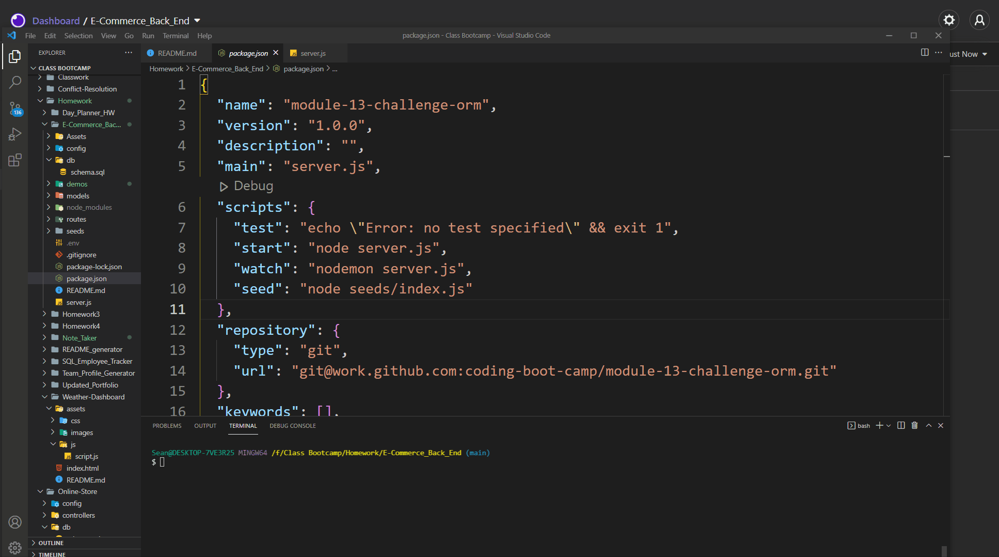

# E-Commerce Back-End

- [Demo](#demo)
- [Description](#description)
- [Installation](#installation)
- [Usage](#usage)
- [Additional Info](#additional-info)

## Demos:

Creating DB: https://drive.google.com/file/d/1-xKLywo8fRfVC45UwIQJgLT7LEtD04Tl/view?usp=sharing

Seeding DB: https://drive.google.com/file/d/1MwYereYsveah0MZx3YZE90hggMfb5_7w/view?usp=sharing

Categories Route: https://drive.google.com/file/d/1eY-73YNgzPhQrKSPVCUalotEu-QLkqns/view?usp=sharing

Products Route: https://drive.google.com/file/d/1nsM7PiHq1RFZJ_V6AmhKPJ6UfoXTDlpn/view?usp=sharing

Tags Route: https://drive.google.com/file/d/1LrJqye7KmbIvBVg4vSRwrOD5tb5YT8G1/view?usp=sharing

## Description:

Here is a basic back-end for any online store using a database. It catalogues data and allows this data to be added, updated, or deleted as needed. This data can be anything that a store would list as a product and allows the products to be attached to speicific tags and categories as well as indicating how many are in stock. See the demos above for a breakdown of all routes and what they are doing.

## Installation

To install this application, copy the contents of this repository into a folder on your comoputer. Navigate to this folder using yoor terminal and install the necessary npm packages using "npm i". You will need an application to see the API data that is being output (such as Insomnia).

## Usage:

Anyone is free to use this repository and add to it.

## Additional Info:

- Github: [Mctastic](https://github.com/mctastic)
- Email: mctastic2121@gmail.com
